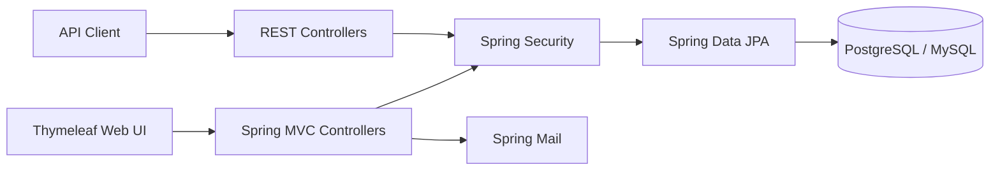

# Happy Tails 🐾

**Full-stack pet-care platform built with Java 17 and Spring Boot.**

Happy Tails brings pet profiles, sitter discovery and booking, marketplace workflows, lost-pet reporting, sightings, and account security into one application. The project is structured as a production-style Java backend with server-rendered UI, REST endpoints, relational persistence, automated tests, API documentation, containerization, and CI.

## Tech Stack

- Java 17
- Spring Boot 3
- Spring MVC + Thymeleaf
- Spring Security + BCrypt
- Spring Data JPA / Hibernate
- REST APIs
- PostgreSQL / MySQL
- Maven
- JUnit 5 + Spring Boot Test
- OpenAPI / Swagger UI
- Docker + Docker Compose
- GitHub Actions

## Core Capabilities

- User registration, authentication, and role-based security foundation
- Pet profile creation and management
- Sitter and booking domain workflows
- Marketplace products and orders
- Lost-pet and sighting workflows
- Messaging domain model
- Authenticated platform REST APIs
- Environment-based database and email configuration

## Architecture



## Project Structure

```text
src/
├── main/
│   ├── java/com/happytails/
│   │   ├── config/
│   │   ├── controller/
│   │   ├── model/
│   │   ├── repository/
│   │   └── web/
│   └── resources/
│       ├── templates/
│       └── application.properties
└── test/
    ├── java/com/happytails/
    └── resources/
```

## Run Locally

### Option 1 — Docker Compose

```bash
docker compose up --build
```

Open `http://localhost:8080`.

### Option 2 — Maven

Create a PostgreSQL or MySQL database and configure environment variables from `.env.example`, then run:

```bash
mvn spring-boot:run
```

## API Documentation

With the application running, Swagger UI is available at:

```text
http://localhost:8080/swagger-ui/index.html
```

OpenAPI JSON is available at:

```text
http://localhost:8080/v3/api-docs
```

## Tests

```bash
mvn clean test
```

Repository and persistence tests use an isolated H2 test database. GitHub Actions runs the test suite and packages the Spring Boot application on every pull request to `main`.

## Deployment

The application includes a multi-stage Dockerfile and environment-based production configuration. PostgreSQL and MySQL drivers are included for deployment flexibility.

## Legacy Version

The original Flask/Python implementation is preserved separately in the `legacy-flask` branch. The default Java codebase intentionally contains only the Spring Boot implementation so the repository accurately reflects the current architecture.

## Author

**Bhavana Angadi**

Software engineering project focused on Java backend development, secure web applications, relational persistence, REST APIs, testing, containerization, and CI/CD.
